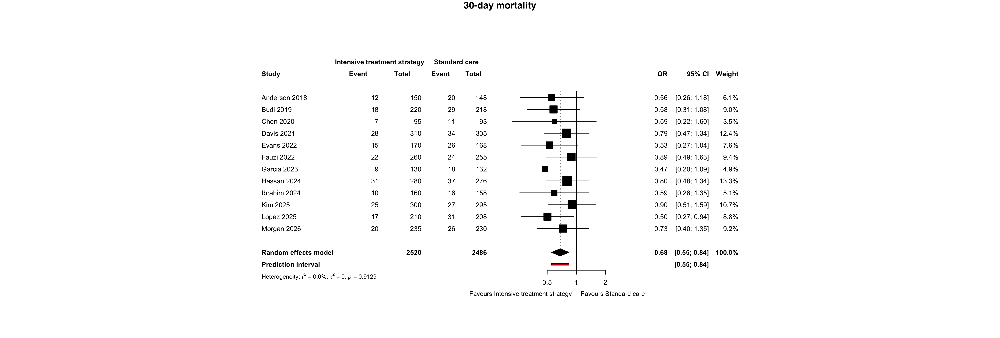
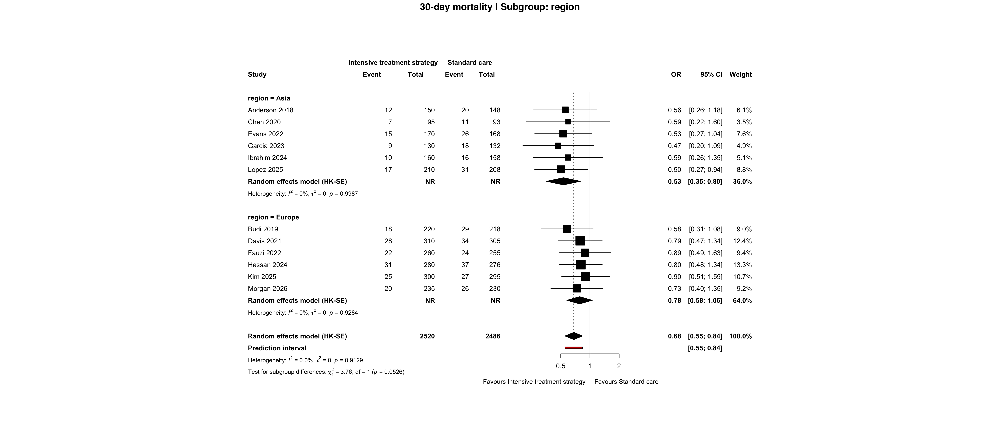
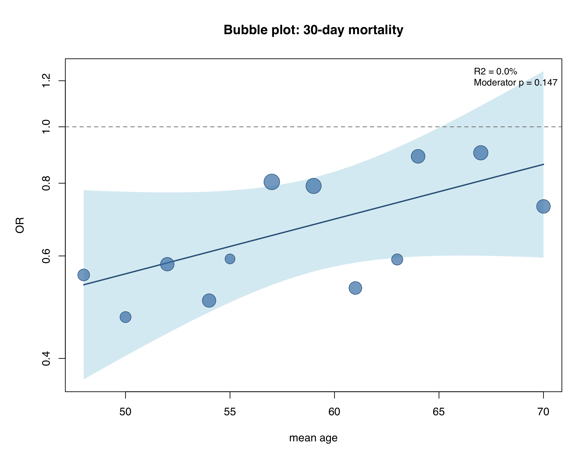
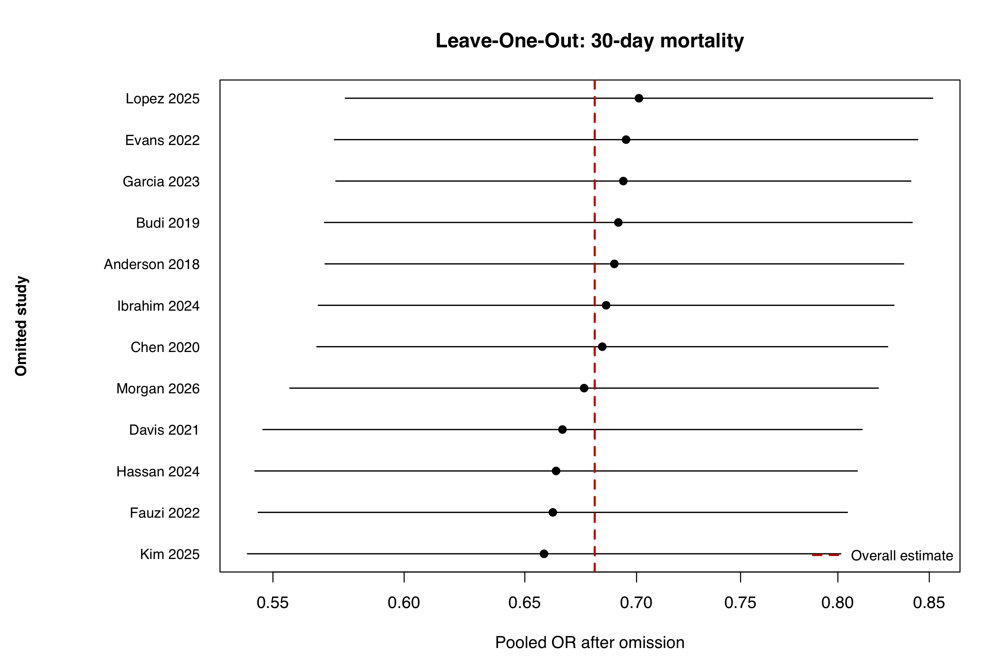
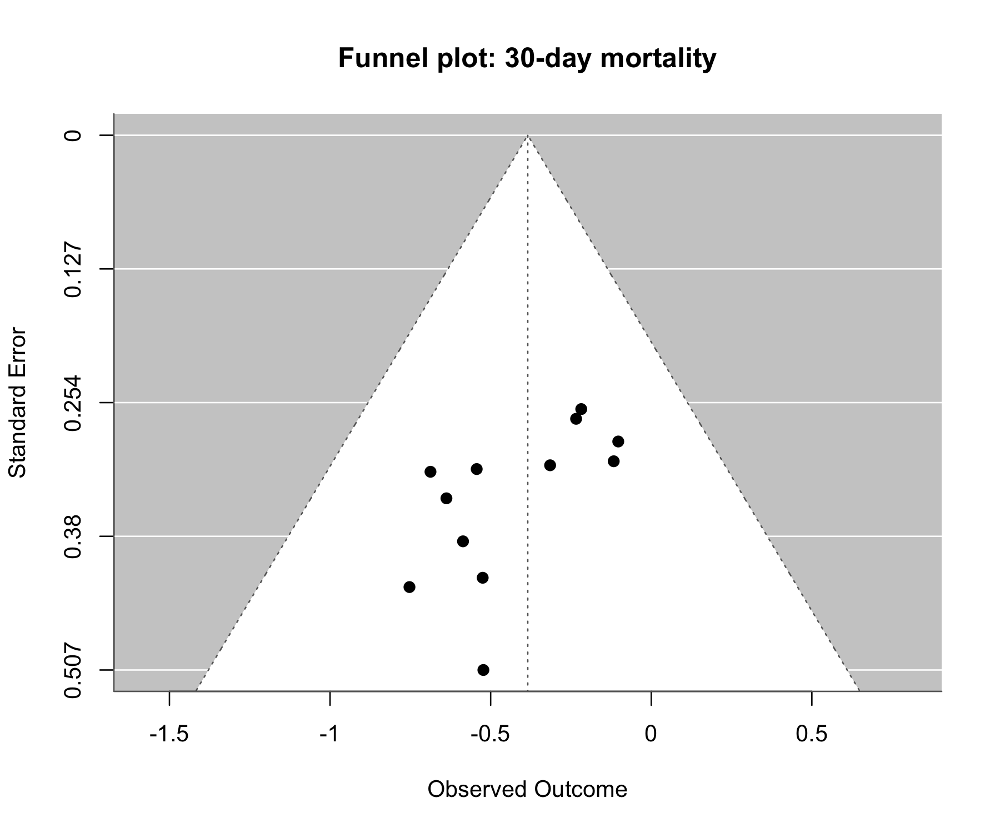
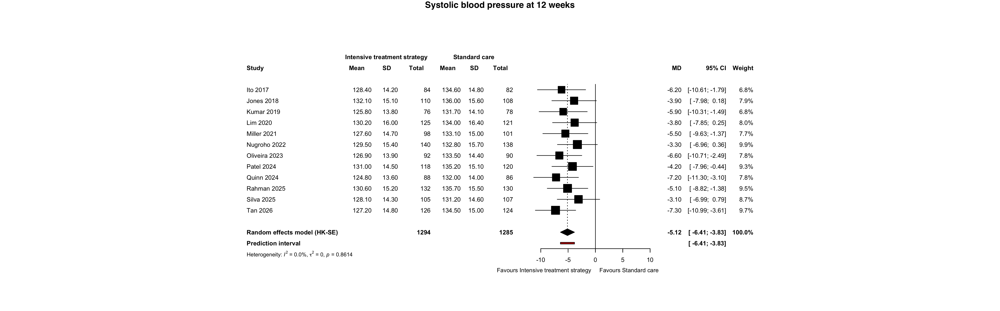
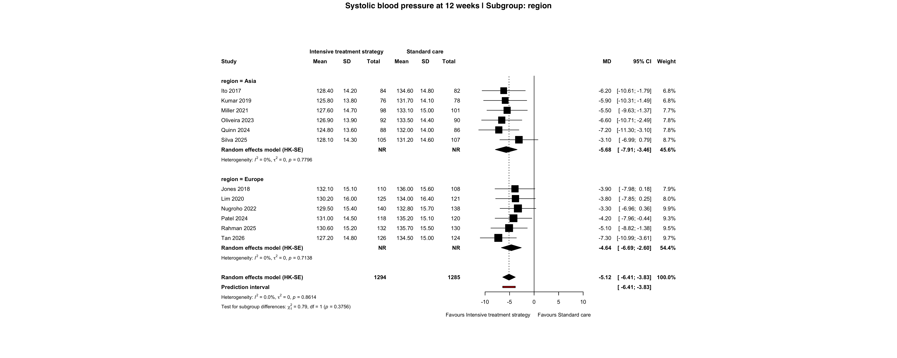
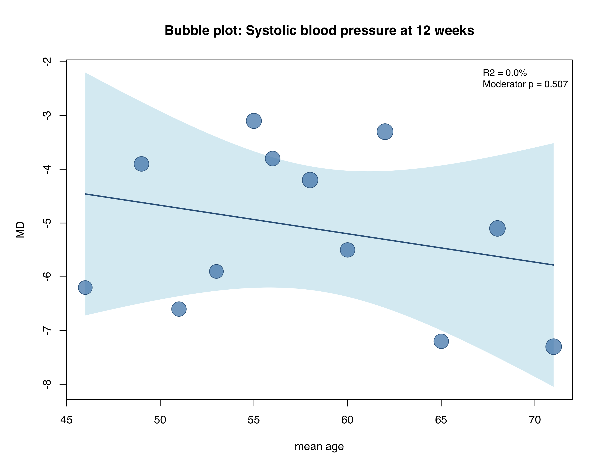
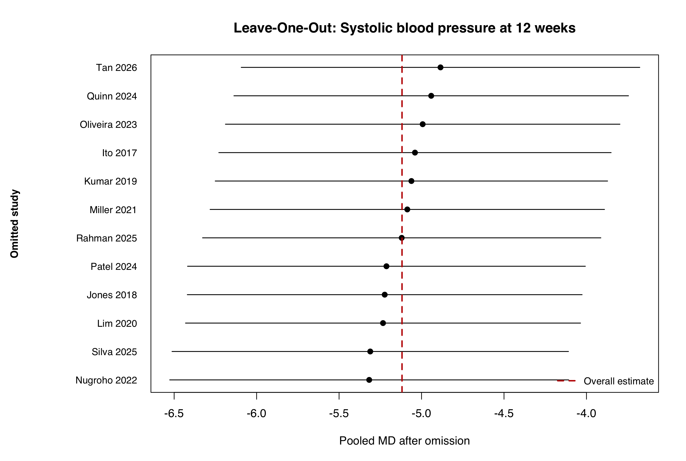
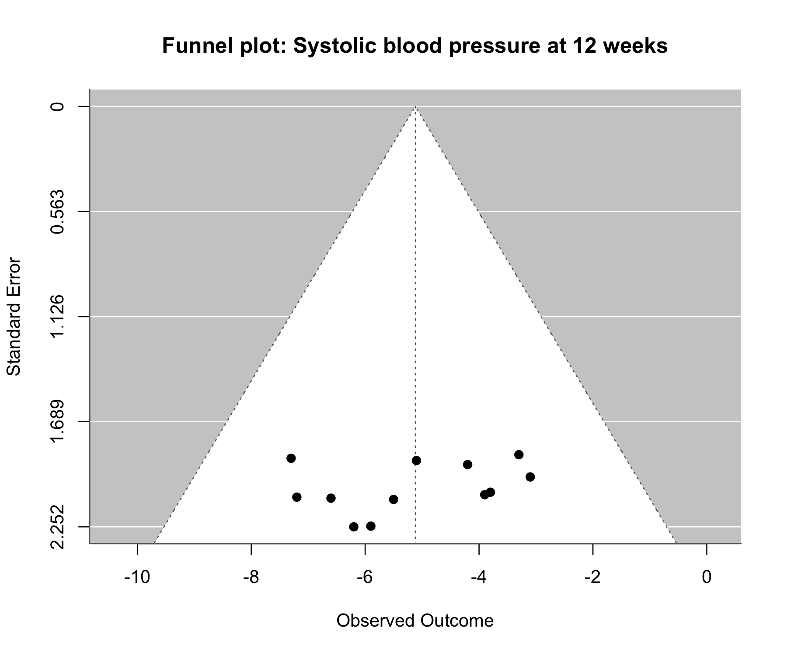

# Auctus MA & NMA Report

- Engine: `2.3.0`
- Schema: `2.3`
- Dibuat: 2026-08-18 16:23:14 WIB

## Daftar outcome

1. [30-day mortality](#30-day-mortality)
2. [Systolic blood pressure at 12 weeks](#systolic-blood-pressure-at-12-weeks)

## 30-day mortality

Status: **SUCCESS**

### Konfigurasi analisis

| field | value |
| --- | --- |
| outcome_name | 30-day mortality |
| analysis_type | pairwise_ma |
| timepoint |  |
| outcome_type | binary |
| effect_measure | OR |
| reference_treatment | Standard care |
| outcome_direction | lower_better |
| unit |  |
| notes | Dummy example: event/sample data for a pairwise odds-ratio meta-analysis. |
| source_sheet | analyses |
| source_row | 2 |

### Overall result

| outcome_name | timepoint | analysis_type | outcome_type | effect_measure | method | k | estimate | ci_low | ci_high | p_value | prediction_low | prediction_high | tau2 | i2_percent | common_estimate | common_ci_low | common_ci_high | reference_treatment |
| --- | --- | --- | --- | --- | --- | --- | --- | --- | --- | --- | --- | --- | --- | --- | --- | --- | --- | --- |
| 30-day mortality |  | pairwise_ma | binary | OR | Mantel-Haenszel random-effects (REML, Hartung-Knapp) | 12 | 0.6808481 | 0.5525398 | 0.8389516 | 0.001909339 | 0.5525398 | 0.8389516 | 0 | 0 | 0.6787781 | 0.564112 | 0.8167523 | Standard care |

### Sensitivity analysis

| outcome_name | timepoint | analysis_type | outcome_type | effect_measure | method | k | estimate | ci_low | ci_high | p_value | prediction_low | prediction_high | tau2 | i2_percent | common_estimate | common_ci_low | common_ci_high | reference_treatment |
| --- | --- | --- | --- | --- | --- | --- | --- | --- | --- | --- | --- | --- | --- | --- | --- | --- | --- | --- |
| 30-day mortality |  | pairwise_ma | binary | OR | Sensitivity: raw_derived | 12 | 0.6808481 | 0.5525398 | 0.8389516 | 0.001909339 | 0.5525398 | 0.8389516 | 0 | 0 | 0.6808481 | 0.5653199 | 0.8199855 | Standard care |

### Subgroup analysis

| subgroup_variable | subgroup | effect_measure | estimate | ci_low | ci_high | k | test_for_difference_p |
| --- | --- | --- | --- | --- | --- | --- | --- |
| subgroup_region | Asia | OR | 0.5327986 | 0.3548263 | 0.8000375 | 6 | 0.0526269 |
| subgroup_region | Europe | OR | 0.7814942 | 0.5761576 | 1.0600108 | 6 | 0.0526269 |

### Source subgroup

_Tidak ada data._

### Meta-regression

| moderator | term | estimate | se | ci_low | ci_high | p_value | moderator_test_p | r2_percent | residual_tau2 | k |
| --- | --- | --- | --- | --- | --- | --- | --- | --- | --- | --- |
| moderator_num_mean_age | intrcpt | -1.66413212 | 0.88723819 | -3.403087026 | 0.07482278 | 0.06070586 | 0.14687 | 0 | 0 | 12 |
| moderator_num_mean_age | x_use |  0.02165154 | 0.01492513 | -0.007601181 | 0.05090425 | 0.14686995 | 0.14687 | 0 | 0 | 12 |

### Leave-one-out analysis

| omitted_study | effect_measure | estimate | ci_low | ci_high | p_value | tau2 | i2_percent |
| --- | --- | --- | --- | --- | --- | --- | --- |
| Anderson 2018 | OR | 0.6897707 | 0.5693538 | 0.8356553 | 1.481858e-04 | 0 | 0 |
| Budi 2019 | OR | 0.6916090 | 0.5691368 | 0.8404359 | 2.088282e-04 | 0 | 0 |
| Chen 2020 | OR | 0.6842669 | 0.5662641 | 0.8268600 | 8.546017e-05 | 0 | 0 |
| Davis 2021 | OR | 0.6664491 | 0.5463432 | 0.8129586 | 6.271126e-05 | 0 | 0 |
| Evans 2022 | OR | 0.6951527 | 0.5728940 | 0.8435020 | 2.291808e-04 | 0 | 0 |
| Fauzi 2022 | OR | 0.6621866 | 0.5446704 | 0.8050576 | 3.543827e-05 | 0 | 0 |
| Garcia 2023 | OR | 0.6938915 | 0.5734314 | 0.8396566 | 1.724183e-04 | 0 | 0 |
| Hassan 2024 | OR | 0.6636236 | 0.5434680 | 0.8103446 | 5.734895e-05 | 0 | 0 |
| Ibrahim 2024 | OR | 0.6860131 | 0.5668021 | 0.8302969 | 1.090744e-04 | 0 | 0 |
| Kim 2025 | OR | 0.6583367 | 0.5407644 | 0.8014714 | 3.117073e-05 | 0 | 0 |
| Lopez 2025 | OR | 0.7011225 | 0.5770544 | 0.8518655 | 3.522102e-04 | 0 | 0 |
| Morgan 2026 | OR | 0.6760778 | 0.5562322 | 0.8217453 | 8.423976e-05 | 0 | 0 |

### Publication bias

| test | statistic | p_value | k |
| --- | --- | --- | --- |
| Egger regression | -2.598872 | 0.02654284 | 12 |

### NMA ranking

_Tidak ada data._

### NMA node splitting

_Tidak ada data._

### NMA inconsistency

_Tidak ada data._

### Transitivity check

_Tidak ada data._

### Method decisions

| decision | value | reason |
| --- | --- | --- |
| binary_method | MH | Non-sparse raw binary data |
| forest_mode | raw_atomic | All selected primary estimates are raw-derived. |

### Plot

#### Forest Overall

#### Forest Subgroup Subgroup Region

#### Bubble Moderator Num Mean Age

#### Leave One Out

#### Funnel

## Systolic blood pressure at 12 weeks

Status: **SUCCESS**

### Konfigurasi analisis

| field | value |
| --- | --- |
| outcome_name | Systolic blood pressure at 12 weeks |
| analysis_type | pairwise_ma |
| timepoint |  |
| outcome_type | continuous |
| effect_measure | MD |
| reference_treatment | Standard care |
| outcome_direction | lower_better |
| unit | mmHg |
| notes | Dummy example: mean, SD, and sample data for a pairwise mean-difference meta-analysis. |
| source_sheet | analyses |
| source_row | 3 |

### Overall result

| outcome_name | timepoint | analysis_type | outcome_type | effect_measure | method | k | estimate | ci_low | ci_high | p_value | prediction_low | prediction_high | tau2 | i2_percent | common_estimate | common_ci_low | common_ci_high | reference_treatment |
| --- | --- | --- | --- | --- | --- | --- | --- | --- | --- | --- | --- | --- | --- | --- | --- | --- | --- | --- |
| Systolic blood pressure at 12 weeks |  | pairwise_ma | continuous | MD | Generic inverse-variance random-effects (REML, Hartung-Knapp) | 12 | -5.118351 | -6.407846 | -3.828855 | 2.801376e-06 | -6.407846 | -3.828855 | 0 | 0 | -5.118351 | -6.266638 | -3.970063 | Standard care |

### Sensitivity analysis

| outcome_name | timepoint | analysis_type | outcome_type | effect_measure | method | k | estimate | ci_low | ci_high | p_value | prediction_low | prediction_high | tau2 | i2_percent | common_estimate | common_ci_low | common_ci_high | reference_treatment |
| --- | --- | --- | --- | --- | --- | --- | --- | --- | --- | --- | --- | --- | --- | --- | --- | --- | --- | --- |
| Systolic blood pressure at 12 weeks |  | pairwise_ma | continuous | MD | Sensitivity: raw_derived | 12 | -5.118351 | -6.407846 | -3.828855 | 2.801376e-06 | -6.407846 | -3.828855 | 0 | 0 | -5.118351 | -6.266638 | -3.970063 | Standard care |

### Subgroup analysis

| subgroup_variable | subgroup | effect_measure | estimate | ci_low | ci_high | k | test_for_difference_p |
| --- | --- | --- | --- | --- | --- | --- | --- |
| subgroup_region | Asia | MD | -5.684834 | -7.914013 | -3.455655 | 6 | 0.3756023 |
| subgroup_region | Europe | MD | -4.642672 | -6.685388 | -2.599957 | 6 | 0.3756023 |

### Source subgroup

_Tidak ada data._

### Meta-regression

| moderator | term | estimate | se | ci_low | ci_high | p_value | moderator_test_p | r2_percent | residual_tau2 | k |
| --- | --- | --- | --- | --- | --- | --- | --- | --- | --- | --- |
| moderator_num_mean_age | intrcpt | -2.02725890 | 4.69169556 | -11.2228132 | 7.1682954 | 0.6656723 | 0.5066641 | 0 | 0 | 12 |
| moderator_num_mean_age | x_use | -0.05286248 | 0.07960726 |  -0.2088898 | 0.1031649 | 0.5066641 | 0.5066641 | 0 | 0 | 12 |

### Leave-one-out analysis

| omitted_study | effect_measure | estimate | ci_low | ci_high | p_value | tau2 | i2_percent |
| --- | --- | --- | --- | --- | --- | --- | --- |
| Ito 2017 | MD | -5.039832 | -6.229067 | -3.850596 | 9.891315e-17 | 0 | 0 |
| Jones 2018 | MD | -5.223348 | -6.420092 | -4.026603 | 1.183633e-17 | 0 | 0 |
| Kumar 2019 | MD | -5.061404 | -6.250785 | -3.872023 | 7.390607e-17 | 0 | 0 |
| Lim 2020 | MD | -5.233567 | -6.430980 | -4.036153 | 1.067096e-17 | 0 | 0 |
| Miller 2021 | MD | -5.086317 | -6.281824 | -3.890810 | 7.509828e-17 | 0 | 0 |
| Nugroho 2022 | MD | -5.317317 | -6.526798 | -4.107836 | 6.890285e-18 | 0 | 0 |
| Oliveira 2023 | MD | -4.993114 | -6.188947 | -3.797281 | 2.752886e-16 | 0 | 0 |
| Patel 2024 | MD | -5.212767 | -6.418639 | -4.006895 | 2.400354e-17 | 0 | 0 |
| Quinn 2024 | MD | -4.941387 | -6.137487 | -3.745286 | 5.628847e-16 | 0 | 0 |
| Rahman 2025 | MD | -5.120286 | -6.327598 | -3.912973 | 9.384476e-17 | 0 | 0 |
| Silva 2025 | MD | -5.310983 | -6.512819 | -4.109148 | 4.668366e-18 | 0 | 0 |
| Tan 2026 | MD | -4.885043 | -6.093171 | -3.676916 | 2.279994e-15 | 0 | 0 |

### Publication bias

| test | statistic | p_value | k |
| --- | --- | --- | --- |
| Egger regression | -1.023726 | 0.3300914 | 12 |

### NMA ranking

_Tidak ada data._

### NMA node splitting

_Tidak ada data._

### NMA inconsistency

_Tidak ada data._

### Transitivity check

_Tidak ada data._

### Method decisions

| decision | value | reason |
| --- | --- | --- |
| primary_method | metagen_REML_HK | Continuous canonical effects |
| forest_mode | raw_atomic | All selected primary estimates are raw-derived. |

### Plot

#### Forest Overall

#### Forest Subgroup Subgroup Region

#### Bubble Moderator Num Mean Age

#### Leave One Out

#### Funnel

## Diagnostics

_Tidak ada data._
